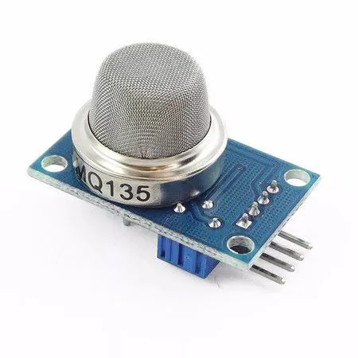
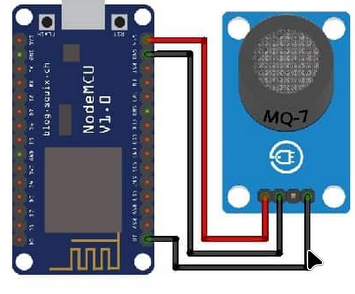

# Relatório

## 1. Resumo 

Neste trabalho será apresentado o desenvolvimento de um sensor de CO2 com transmissão de dados utilizando o módulo ESP8266 e o protocolo MQTT. Além disso, foi implementada uma funcionalidade de time stamp para registrar a data e hora das leituras enviadas para o broker. Essa abordagem permite uma análise mais precisa e um melhor entendimento dos níveis de CO2 no ambiente monitorado, contribuindo para a tomada de decisões eficientes em relação à qualidade do ar.

## 2. Introdução.

Neste relatório, será estabelecido a conexão, pinagem, e citação de materiais necessários para realizar a conexão MQTT (Message Queue Telemetry Transport) de um ESP8266. Não obstante, o envio dos dados de um sensor de gás carbonico (CO2) - MQ135, via broker também será realizada.

Iniciamos da seguinte forma, com os materiais necessários para implementação do mesmo, tal qual:

* ESP8266.
* Jumper.
* Cabo USB (Tipo-B) para alimentar o ESP8266.
* Sensor MQ-135.
* Protoboard (Opcional caso não haja pinagem soldada no ESP8266).

## 3. Metodologia

Para atingir o objetivo proposto, foram utilizados os seguintes componentes e tecnologias:

## 3.1 Módulo ESP8266 

O módulo ESP8266 foi selecionado como plataforma de desenvolvimento devido à sua capacidade de se conectar a redes Wi-Fi e sua compatibilidade com o protocolo MQTT. Esse módulo permite a integração do sensor de CO2 e a transmissão dos dados coletados para um broker MQTT.


## 3.2 Protocolo MQTT

O protocolo MQTT (Message Queuing Telemetry Transport) é um protocolo leve e de baixo consumo de energia, o que o torna ideal para o envio de dados de sensores em redes de dispositivos conectados.

## 3.3 Sensor de CO2

Foi utilizado um sensor de CO2 de alta precisão para realizar as medições dos níveis de dióxido de carbono no ambiente monitorado. tal sensor fornece leituras confiáveis e estáveis, garantindo a qualidade dos dados coletados.



## 3.4 Time Stamp

Tambem foi implementado uma funcionalidade de time stamp para registrar a data e hora das leituras enviadas para o broker MQTT. Essa informação é fundamental para análises posteriores e permite um melhor entendimento das variações nos níveis de CO2 ao longo do tempo.

## 4. Pinout Modelo Esquemático.

Abaixo (1), está o modelo esquemático da pinagem para implementação do ESP8266:




Na imagem abaixo (2), foi utilizado o sensor MQ-7, mas o mesmo esquemático se aplica ao MQ-135, pois a pinagem do MQ-135 se dá por:


As entradas se dá por, respectivamente:
* A0 - Saída do valor analógico registrado/medido pelo sensor.
* D0 - Saída digital, o valor limite de tolerância pode ser definido usando o potenciômetro.
* GND - Terra/GND.
* VCC - Entrada de energia (3.3v). [Cuidado, se colocar em 5v a probabilidade de ocorrer acidentes é alta!].

## 5. Código.

Incluindo as bibliotecas:

```
#include <ESP8266WiFi.h>          

#include <PubSubClient.h>   

#include <NTPClient.h>

#include <WiFiUdp.h>

```
(No código acima, não foi incluido, mas para o funcionamento do mesmo, é necessário incluir e instalar a bilioteca respectiva ao sensor que será utilizado, tal qual: "MQ-2, MQ-3, MQ-135" e afins, sem a mesma, não haverá calibração e respectivamente não funcionará o mesmo, no arquivo 'Codigo.ino' a biblioteca.)

Para encontrar a biblioteca do ESP8266, é necessário colocar esse URL (http://arduino.esp8266.com/stable/package_esp8266com_index.json) no diretório: Files -> Preferences -> 'Additional Boards Manager URLs:'. 

Após isso, vá em: Tools -> Board -> Boards Manager... e pesquise por 'ESP8266' e adicione.

Depois, Sketch -> Include Library -> Manage Libraries e pesquise por 'PubSubClient' e adicione.

Não obstante, logo abaixo está a definição da variável que vai receber o valor analógico do sensor, no pino A0.

NTPClient.h biblioteca desenvolvida para sincronizar com o servidor NTP, essa biblioteca foi adicionada para realizar uma sincronização do sensor com o valor do tempo/horário atual, para criar uma timestamp, com o objetivo de entender em qual horário que foi valor foi medido.

WiFiUdp.h Biblioteca que lida com as tarefas do protocolo UDP, enviando e recebendo pacotes UDP enquanto estiver online.

```
#define sensor A0
```

Logo abaixo, existe o código predefinido para que o ESP8266 entenda qual é a Rede que você está conectado (Ou qualquer uma que esteja em sua área de sinal). A respectiva senha do mesmo, e o broker que vai ser utilizado.

Após, a declaração de um objeto de classe WiFiClient que permite a conexão com um especifico IP e porta definida, e o PubSubClient recebe uma entrada de um construtor previamente definido pelo WiFiClient.
E logo em seguida, foi setado o servidor responsável em manter o horário mundial específico da américa do sul, existem outros como por exemplo:

* pool.ntp.org
* asia.pool.ntp.org
* europe.pool.ntp.org
* north-america.pool.ntp.org
* oceania.pool.ntp.org

Definição do buffer, que no caso é o tamanho da mensagem que vai ser enviada (Quantidade total de caracteres), e da tolerância da taxa de gás carbonico medida pelo sensor (MQ-135).

```
const char* ssid = "(Substitua pelo seu WiFi)"; 

const char* password = "(Coloque a senha do mesmo)"; 

const char* mqtt_server = "test.mosquitto.org"; //broker padrão mqtt gratuito para testes.

WiFiUDP ntpUDP;

NTPClient timeClient(ntpUDP, "south-america.pool.ntp.org");

WiFiClient espClient;

PubSubClient client(espClient);


unsigned long lastMsg = 0;

#define MSG_BUFFER_SIZE  (50)

char msg[MSG_BUFFER_SIZE];                   

int tolerancia = 100000;
```

Abaixo, configurações antes e depois da conexão ter sido feita, vai ocorrer um print no serial do arduino enquanto a conexão com o Wi-Fi não for concluida, e respectivamente, printar um "." enquanto o status do wifi for diferente de conectado, e quando conectar, printar uma mensagem de confirmação e o respectivo endereço IP.

"WiFi.mode()" Quando insere o comando "WIFI_STA" nos dentro dos colchetes, você estará definindo a placa ESP8266 no modo estação, tal modo esse que funciona da seguinte forma, quando iniciado, ou chamado, ele consegue conectar a outras redes, como se fosse um respectivo roteador, não obstante, certamente após a conexão, a placa ESP8266 recebe um endereço de IP unico, com isso, ele consegue se comunicar com outros dispositivos, que no caso são estações, conectadas na mesma rede, mas, a conexão vai ser feita e conectada com o endereço IP do próprio ESP8266 que foi definida. 

"WiFi.begin()" Feito para iniciar com o login (ssid) e a senha do WiFi, após, uma função foi feita para aguardar enquanto a conexão não foi estabelecida, colocando um ". (Ponto)" enquanto o status do wifi for diferente de conectado.

O comando "randomSeed(micros())" foi usado para inicializar o gerador de números pseudoaleatórios com uma semente baseada no tempo atual, garantindo que diferentes execuções do programa gerem sequências de números pseudoaleatórios distinta, para atualizar, na medida que cada valor fosse recebido.

Em resumo, esse trabalho se baseou na seguinte forma o roteador foi definido como um ponto de acesso principal, e as estações (ESP8266, e qualquer dispositivo conectado ao broker). 
Tambem é possivel definir a placa ESP8266 como um ponto de acesso, igual ao roteador, mas não foi necessário nesse trabalho.

```
void setup_wifi() {

  delay(500);

  Serial.println();

  Serial.print("Conectando ao Wifi: ");

  Serial.println(ssid);

  WiFi.mode(WIFI_STA);

  WiFi.begin(ssid, password);

  while (WiFi.status() != WL_CONNECTED) {

  delay(500);

  Serial.print(".");

  }

  randomSeed(micros());

  Serial.println("");

  Serial.println("Conectado!");

  Serial.println("IP: ");

  Serial.println(WiFi.localIP());

}
```

Logo abaixo, uma funçao callback foi criada, cujo objetivo principal é, após uma mensagem ter sido de fato enviada e recebida sem nenhum problema, envie uma confirmação de mensagem no serial, especificando em qual tópico a mensagem foi enviada e recebida, e continue enquanto a mensagem for enviada.

```
void callback(char* topic, byte* payload, unsigned int length) {

  Serial.print("Mensagem Recebida no Topico [");

  Serial.print(topic);

  Serial.print("] ");

  for (int i = 0; i < length; i++) {

  Serial.print((char)payload[i]);
  
  }
  Serial.println();

}
```

Não obstante, a função de reconexão foi criada, que diz, enquanto o status do cliente for diferente de conectado, realize um print que está tentando reconectar a conexão com o client definido, agora, se o cliente estiver conectado, mande uma mensagem confirmando que está, e publique no tópico criado no broker a seguinte mensagem de "olá mundo" e se inscreva no tópico. Agora, caso nenhuma das alternativas foram concluidas com sucesso, envie uma confirmação de falha e printe o status no serial.

```
void reconnect() {
  
  while (!client.connected()) {

  Serial.print("Tentando reconectar...");

  String clientId = "CO2-ESP8266-Client-";

  clientId += String(random(0xffff), HEX);

  if (client.connect(clientId.c_str())) {

    Serial.println("Conectado!");

    client.publish("labnet/CO2", "hello world");

    client.subscribe("labnet/CO2");

  } else {

    Serial.print("Falha ao conectar, rc=");

    Serial.print(client.state());

    delay(5000);

    }

  }

}
```

Função setup, onde chama a função "setup_wifi" e seta o valor da taxa de leitura serial em 115200 Baund Rate, e define broker na porta 1883 e chama a função callback de mensagem.
A função "client.setServer(mqtt_server, 1883)" realiza a seguinte tarefa, conecta ao servidor no endereço que foi definido
Respectivamente, foi chamado a função timeClient.begin() para iniciar o cliente NTP, e logo após, foi definido o fuso horário da américa do sul, que é GMT -3, em segundos o calculo é realizado da seguinte forma: (GMT da sua região: -1, -2, -3...) * 60 * 60, realizar essa multiplicação vai lhe voltar um valor, esse valor é o seu respectivo fuso horário em segundos, coloque esse valor na função timeClient.setTimeOffset() para calibrar com o seu respectivo horário.

```
void setup() {

  Serial.begin(115200);

  setup_wifi();

  client.setServer(mqtt_server, 1883);

  client.setCallback(callback);

  timeClient.begin();

  timeClient.setTimeOffset(-10800);

}
```

Função loop (Laço de repetição, onde o valor de sensor vai ser medido e enviado para o broker repetidamente). 

A primeira condição na função é, se o cliente não estiver conectado, reconecte.

Definindo a variável value_gas para que receba o valor análogo inteiro da variável sensor no pino A0, e caso esse valor seja maior do que a tolerancia definida, printe no monitor serial e no broker um aviso que a taxa está extremamente elevada e espere 1 segundo, e caso não seja, apenas printe o valor da taxa de gás medida no tópico do broker definido.
Não obstante, foi definida um formato padrão para retornar o valor do tempo, tal formato esse que é de Horas:Minutos:Segundos, existe uma função pre-definida pelo timeClient, chamada "timeClient.getFormattedTime()", essa função retorna os valores do horário no formato dito anteriormente. 

Complementando com os valores da data atual, pra isso, foi necessário utilizar novamente o servidor de salvamento de dados do dia atual, e batou apenas chama-las para a função, tal qual, inicialmente, foi definido o tempo da época (função essa pré-definida na database) "timeClient.getEpochTime()" essa função obtém o valor da data da época atual, após, foi criada outra estruturada para receber esse valor, nesse momento foi definido como um inteiro o valor do dia, do mês atual e do ano atual, não obstante, todas essas variáveis foram chamadas numa final, "atualData" que recebe todos os valores coletados e transforma em apenas 1 string. 
Como a variavel "tm_mday" se inicia com o valor em 0, basta adicionarmos o valor inteiro 1 ao mês para que "janeiro" seja respectivo com o mesmo valor igual a 1, fevereiro a 2 e assim por diante.
Logo abaixo, foi criada a variavel cujo recebe o valor inteiro "atualMes" que como o próprio nome diz, ela obtem o valor inteiro do mês respectivo atual.
A seguir, "atualAno", com essa biblioteca, ela apenas consegue salvar valores do ano a partir de 1900, logo, é necessario adicionar esse valor inteiro na nova variavel para conseguir corresponder com o ano que se encontra atualmente.


```
void loop() {

  if (!client.connected()) {

  reconnect();

  }

  client.loop();

  timeClient.update();

  unsigned long now = millis();

  int value_gas = analogRead(sensor); 

//Definindo o tempo e a data

  time_t epochTime = timeClient.getEpochTime();

  struct tm *ptm = gmtime ((time_t *)&epochTime); 

  int diaMes = ptm-> tm_mday;

  int atualMes = ptm-> tm_mon + 1;

  int atualAno = ptm-> tm_year + 1900;

  String atualData = String(atualAno) + "-" + String(atualMes) + "-" + String(diaMes);

  if(value_gas > tolerancia){ 
    
  Serial.print("TAXA DE CO2 MUITO ALTA, FOGO");
    
  Serial.println();

  Serial.println();

  String formattedTime = timeClient.getFormattedTime();

  snprintf (msg, MSG_BUFFER_SIZE, "TAXA DE CO2 MUITO ALTA! - [Horário: %s] - [Data: %s]", formattedTime, atualData);
  
  client.publish("lens/CO2", msg);
   
  delay(1000); 

  }
  
  else {
    
  if (now - lastMsg > 2000) {

  lastMsg = now;

  String formattedTime = timeClient.getFormattedTime();

  Serial.println();

  snprintf (msg, MSG_BUFFER_SIZE, "Taxa de Gás: %ld ppm - [Horário: %s]- [Data: %s]", value_gas, formattedTime, atualData);

  Serial.println(msg);

  Serial.println();

  client.publish("labnet/CO2", msg);

  delay(1000);

    }
 
  }
 
}
```

## 6. Resultados e Discussão

O sensor de CO2 com transmissão de dados utilizando o módulo ESP8266 e o protocolo MQTT foi implementado com sucesso. As leituras de CO2, juntamente com as informações de time stamp, foram enviadas para o broker MQTT de forma eficiente e essa abordagem permitiu uma análise mais precisa e um melhor entendimento dos níveis de CO2 no ambiente monitorado. A disponibilidade dos dados em tempo real possibilita a identificação de padrões e variações nos níveis de CO2 ao longo do tempo, auxiliando na tomada de decisões eficientes em relação à qualidade do ar.

## 7. Referências e Material de Leitura.

* 1) (https://how2electronics.com/gas-level-monitor-esp8266-gas-sensor/), Autor: How to Electronics.

* 2) (https://www.circuits-diy.com/mq135-air-quality-smoke-gas-sensor/), Autor: Farwah Nawazi.

* 3) (https://randomnerdtutorials.com/esp32-useful-wi-fi-functions-arduino/), Autor: Random Nerd Tutorials.

* 4) (https://lastminuteengineers.com/esp8266-ntp-server-date-time-tutorial/), Autor: Last Minute Engineers.

* 5) (https://linuxhint.com/esp32-ntp-client-server-date-time/), Autor: Kashif.

* 6) (https://randomnerdtutorials.com/esp8266-nodemcu-date-time-ntp-client-server-arduino/), Autor: Random Nerd Tutorials.

* 7) (https://github.com/Martinsos/arduino-lib-hc-sr04), Autor: Martinsos.

* 8) (https://www.instructables.com/Getting-Time-From-Internet-Using-ESP8266-NTP-Clock/), Autor: Utsource.

* 9) (https://techtutorialsx.com/2017/04/09/esp8266-connecting-to-mqtt-broker/), Autor: Techtutorialsx.

* 10) (https://www.instructables.com/NodeMCU-MQTT-Basic-Example/), Autor: Osoyooproduct.